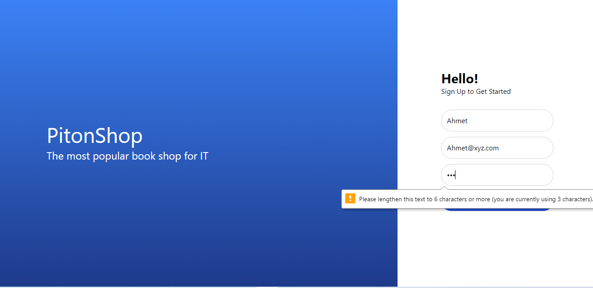

PITON Shop:

what has been done? 
- initialize the app
- configure Tailwind CSS
- configure Redux, Redux Toolkit
- Build Register Screen UI
- Build App Auth state
- Register API call & local update

Todo list:
- Build Login Screen UI
- Build Products List Screen UI
- Build Product Details Screen UI
- Ensure that the pages match the design
- implement some animation
- Login, Get Products API calls
- save data to local storage & check if token is valid

-------------
Register Page:
